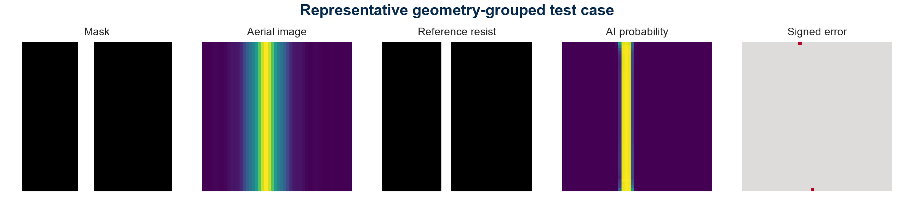
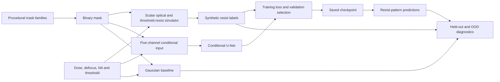

# LithoTwin - AI-Accelerated Computational Lithography

[Read the project report (PDF)](docs/PROJECT_REPORT.pdf) · [Explore the explanation and flow diagram](docs/PROJECT_REPORT.md)

## Inspect an actual model output



Saved test prediction panel: mask input, simulator reference and learned resist prediction. Simulator-backed computational study, not a fabricated-wafer image. See [figure source](outputs/figures/prediction_panel.png) and [setup instructions](#run-on-macoslinux). After setup, `python scripts/make_figures.py` regenerates this panel from the saved checkpoint and dataset. It selects test index `ids[len(ids)//3]` deterministically; “representative” is a figure label, not a statistical sampling claim. The showcase is a copy of that saved figure.


LithoTwin asks a computational-lithography question: **can a compact neural model reproduce a simulated resist pattern from a mask and its exposure conditions, and where does that approximation fail?** It trains a conditional U-Net to predict developed resist contours from a binary mask, dose, defocus, numerical aperture and resist threshold.

The reference labels come from a transparent scalar Fourier-optics simulator, not measured wafers or experimental fab data. The saved in-distribution test report records **0.9019 IoU and 0.9285 Dice on 252 synthetic clips**, but the recorded out-of-distribution scores are substantially weaker. The recorded CPU timing also does **not** demonstrate a speedup over the simulator. This is an educational surrogate-modeling prototype, not production lithography, optical proximity correction (OPC), or a chemically amplified resist solver.


## Technical snapshot

| Question | Implementation |
|---|---|
| What is trained? | Compact conditional U-Net with five input channels: mask plus four broadcast process parameters |
| What supplies the labels? | Nine-source scalar Fourier-optics approximation followed by threshold resist development |
| Dataset | 3,360 locally generated 48 × 48 clips from 420 procedural base-mask IDs and eight process conditions per base |
| Mask families | Lines, line ends, spaces, elbows, dense lines, two-line gaps and contacts |
| Baseline | Gaussian blur and threshold development |
| Evaluation | IoU, Dice, contour distance, area error, Brier score, uncertainty diagnostics and measured runtime |
| Interfaces | Streamlit workbench and CLI inference, training and evaluation |
| Not demonstrated | Experimental wafer fidelity, production OPC, calibrated physical uncertainty or inference acceleration |

## System flow

```text
Procedural binary mask + sampled process conditions
    → nine-source scalar Fourier optics → aerial intensity → threshold resist label
    → base-ID train / validation / test assignment and separate OOD sets
    → conditional U-Net training → validation-selected checkpoint
    → predicted resist pattern → baseline comparison and recorded evaluation
```

## Architecture



## Dataset: locally generated simulator examples

There is **no external fab dataset** in this project. [`scripts/generate_data.py`](scripts/generate_data.py) calls [`src/lithotwin/data.py`](src/lithotwin/data.py) to generate semiconductor-like binary masks and their process-conditioned labels. With the default seed 42, 420 base-mask draws and eight conditions per base produce the checked-in [`data/lithography.npz`](data/lithography.npz): **3,360 examples at 48 × 48 resolution**. Each example stores the mask, four process parameters, simulated aerial intensity, binary resist label, family, base ID and split. These are repeated process conditions on procedural layouts—not 3,360 independent measured wafers.

| Partition | Clips | Purpose |
|---|---:|---|
| Training | 2,016 | Fit the neural surrogate |
| Validation | 252 | Select the checkpoint by validation loss |
| Test | 252 | Held-out base IDs under the sampled in-range conditions |
| Process OOD | 360 | Extreme dose/defocus combinations on non-contact base IDs |
| Geometry OOD | 480 | Contact family, excluded from training |

In-range conditions sample dose **0.78–1.22**, defocus **−1.15–1.15**, numerical aperture **0.58–0.72** and threshold **0.25–0.48**. The process-OOD examples use dose **0.68 or 1.32** and defocus **−1.8 or 1.8**. Dose and defocus follow the simulator's normalized conventions; they are not calibrated experimental exposure units. Training, validation and in-range test use distinct base IDs, while **process OOD intentionally reuses base IDs**, including training bases. Base-ID grouping does not itself prove that independently sampled binary masks are all unique.

## Implemented

- Procedural semiconductor-like mask families: line, line-end, space, elbow, dense lines, two-line gaps, and contacts
- Nine-source scalar Abbe imaging with circular pupils and quadratic defocus phase
- Dose, defocus, numerical-aperture, and resist-threshold conditioning
- Base-ID-grouped train/validation/test partitions
- Separate process-range and unseen-contact-family OOD evaluations
- Gaussian imaging baseline and conditional U-Net
- IoU, Dice, symmetric contour distance, area error, Brier score, uncertainty-error correlation, and runtime measurements
- Streamlit workbench, CLI inference, tests, saved checkpoint, and presentation-ready report

## Run on macOS/Linux

```bash
python3 -m venv .venv
source .venv/bin/activate
python -m pip install -r requirements.txt
python scripts/generate_data.py
python scripts/train.py --epochs 12
python scripts/evaluate.py
streamlit run app.py
```

## Run on Windows PowerShell

```powershell
py -3.12 -m venv .venv
.\.venv\Scripts\Activate.ps1
python -m pip install -r requirements.txt
python scripts/generate_data.py
python scripts/train.py --epochs 12 --device cpu
python scripts/evaluate.py
streamlit run app.py
```

## Scientific scope

The optical model averages intensities from nine shifted scalar pupils to approximate partial coherence, with circular pupils and quadratic defocus phase. It is not a calibrated continuous-source or vector optical solver. Polarization, flare, calibrated aberrations, resist diffusion and chemical kinetics are omitted. The resist label is simply a threshold on simulated aerial intensity. Results measure neural fidelity to this declared simulator only.

The existing measurements are preserved in [`outputs/metrics.json`](outputs/metrics.json); this documentation update does not retrain or rerun the models. Its out-of-distribution predictions and uncertainty figures require care: the current evaluator switches the whole model to training mode for repeated stochastic passes, enabling BatchNorm updates as well as dropout, and does not reset evaluation mode between partitions. These are recorded prototype diagnostics, not a clean frozen-state OOD benchmark or calibrated uncertainty guarantee. Runtime figures are implementation-specific measurements, not evidence of production acceleration.

## Tests

```bash
python -m pytest -q
```
