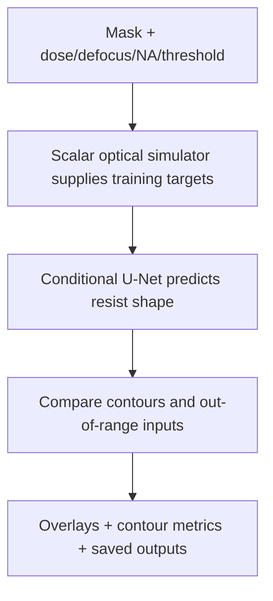

# LithoTwin

Project report | Harsh Saand | 22 September 2026

## The problem

Changing a mask or exposure setting changes the printed shape. LithoTwin lets a reader compare a learned contour predictor with the simplified optical simulator that generated its training examples.

## What a user gets

Choose mask geometry and process settings, then inspect predicted resist contours, simulator contours, differences and uncertainty views. The tool produces an engineering comparison rather than a single similarity score.

## Practical value

The project demonstrates conditional image modelling and exposes failure under unfamiliar process settings and geometry. Its fidelity is measured against its own simplified simulator. The saved timing does not establish an overall speed advantage.

## Logic and flow



<details>
<summary><strong>Dataset: locally generated simulator examples</strong></summary>

There is **no external fab dataset** in this project. [`scripts/generate_data.py`](https://github.com/HarshSaand/lithotwin-computational-lithography/blob/cf04e29e073f5f2904e42a1cd5d38ad2971be1c0/scripts/generate_data.py) calls [`src/lithotwin/data.py`](https://github.com/HarshSaand/lithotwin-computational-lithography/blob/cf04e29e073f5f2904e42a1cd5d38ad2971be1c0/src/lithotwin/data.py) to generate semiconductor-like binary masks and their process-conditioned labels. With the default seed 42, 420 base-mask draws and eight conditions per base produce the checked-in [`data/lithography.npz`](https://github.com/HarshSaand/lithotwin-computational-lithography/blob/cf04e29e073f5f2904e42a1cd5d38ad2971be1c0/data/lithography.npz): **3,360 examples at 48 × 48 resolution**. Each example stores the mask, four process parameters, simulated aerial intensity, binary resist label, family, base ID and split. These are repeated process conditions on procedural layouts; not 3,360 independent measured wafers.

| Partition | Clips | Purpose |
|---|---:|---|
| Training | 2,016 | Fit the neural surrogate |
| Validation | 252 | Select the checkpoint by validation loss |
| Test | 252 | Held-out base IDs under the sampled in-range conditions |
| Process OOD | 360 | Extreme dose/defocus combinations on non-contact base IDs |
| Geometry OOD | 480 | Contact family, excluded from training |

In-range conditions sample dose **0.78-1.22**, defocus **-1.15-1.15**, numerical aperture **0.58-0.72** and threshold **0.25-0.48**. The process-OOD examples use dose **0.68 or 1.32** and defocus **-1.8 or 1.8**. Dose and defocus follow the simulator's normalized conventions; they are not calibrated experimental exposure units. Training, validation and in-range test use distinct base IDs, while **process OOD intentionally reuses base IDs**, including training bases. Base-ID grouping does not itself prove that independently sampled binary masks are all unique.

</details>

<details>
<summary><strong>Technical snapshot</strong></summary>

| Question | Implementation |
|---|---|
| What is trained? | Compact conditional U-Net with five input channels: mask plus four broadcast process parameters |
| What supplies the labels? | Nine-source scalar Fourier-optics approximation followed by threshold resist development |
| Dataset | 3,360 locally generated 48 × 48 clips from 420 procedural base-mask IDs and eight process conditions per base |
| Mask families | Lines, line ends, spaces, elbows, dense lines, two-line gaps and contacts |
| Baseline | Gaussian blur and threshold development |
| Evaluation | IoU, Dice, contour distance, area error, Brier score, uncertainty diagnostics and measured runtime |
| Interfaces | Streamlit workbench and CLI inference, training and evaluation |
| Not demonstrated | Experimental wafer fidelity, production OPC, calibrated physical uncertainty or inference acceleration |

</details>

<details>
<summary><strong>Recorded results</strong></summary>

On 252 held-out simulator clips, the conditional U-Net records IoU 0.902 and Dice 0.928, versus baseline IoU 0.731 and Dice 0.823. On process-OOD inputs, recorded IoU drops to 0.351 versus baseline 0.429; on unseen geometry it drops to 0.373 versus baseline 0.652. The evaluator-state limitation discussed below means the OOD values are diagnostics, not clean frozen-state benchmark estimates. In-range prediction takes 773 microseconds per clip versus 644 for the simulator, so this implementation does not establish acceleration.

</details>

<details>
<summary><strong>Implemented</strong></summary>

- Procedural semiconductor-like mask families: line, line-end, space, elbow, dense lines, two-line gaps, and contacts
- Nine-source scalar Abbe imaging with circular pupils and quadratic defocus phase
- Dose, defocus, numerical-aperture, and resist-threshold conditioning
- Base-ID-grouped train/validation/test partitions
- Separate process-range and unseen-contact-family OOD evaluations
- Gaussian imaging baseline and conditional U-Net
- IoU, Dice, symmetric contour distance, area error, Brier score, uncertainty-error correlation, and runtime measurements
- Streamlit workbench, CLI inference, tests, saved checkpoint, and presentation-ready report

</details>

<details>
<summary><strong>Scientific scope</strong></summary>

The optical model averages intensities from nine shifted scalar pupils to approximate partial coherence, with circular pupils and quadratic defocus phase. It is not a calibrated continuous-source or vector optical solver. Polarization, flare, calibrated aberrations, resist diffusion and chemical kinetics are omitted. The resist label is simply a threshold on simulated aerial intensity. Results measure neural fidelity to this declared simulator only.

The existing measurements are preserved in [`outputs/metrics.json`](https://github.com/HarshSaand/lithotwin-computational-lithography/blob/cf04e29e073f5f2904e42a1cd5d38ad2971be1c0/outputs/metrics.json); this documentation update does not retrain or rerun the models. Its out-of-distribution predictions and uncertainty figures require care: the current evaluator switches the whole model to training mode for repeated stochastic passes, enabling BatchNorm updates as well as dropout, and does not reset evaluation mode between partitions. These are recorded implementation diagnostics, not a clean frozen-state OOD benchmark or calibrated uncertainty guarantee. Runtime figures are implementation-specific measurements, not evidence of production acceleration.

</details>

<details>
<summary><strong>Using the project</strong></summary>

```bash
python3 -m venv .venv
source .venv/bin/activate
python -m pip install -r requirements.txt
python scripts/generate_data.py
python scripts/train.py --epochs 12
python scripts/evaluate.py
streamlit run app.py
```

</details>

## Evidence and reproduction references

Source revision: cf04e29e073f5f2904e42a1cd5d38ad2971be1c0

- [README.md](https://github.com/HarshSaand/lithotwin-computational-lithography/blob/cf04e29e073f5f2904e42a1cd5d38ad2971be1c0/README.md)
- [docs/output-example.json](https://github.com/HarshSaand/lithotwin-computational-lithography/blob/cf04e29e073f5f2904e42a1cd5d38ad2971be1c0/docs/output-example.json)
- [outputs/metrics.json](https://github.com/HarshSaand/lithotwin-computational-lithography/blob/cf04e29e073f5f2904e42a1cd5d38ad2971be1c0/outputs/metrics.json)

This report describes the source and saved evidence at the revision above. Training and full benchmark runs were not repeated for this documentation release. Dataset, model and dependency licences remain separate from the project documentation.
